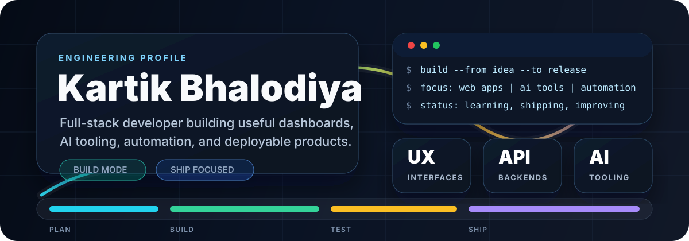
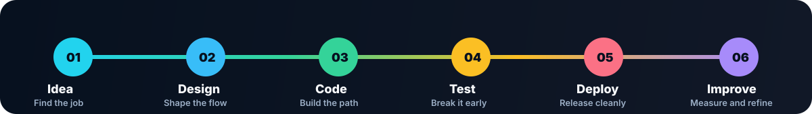

  

  

  
  
  

<h2 align="center">I build practical software: dashboards, AI tools, automation, APIs, and mobile-ready product flows.</h2>

  My focus is simple: understand the real workflow, build the useful version first, then improve the interface, reliability, and deployment path until it feels ready to use.

---

## Control Panel

| Signal | Current Direction | Quality Bar |
| --- | --- | --- |
| Product UI | Clean dashboards, admin panels, and task-focused screens | Clear state, responsive layout, no visual clutter |
| AI and automation | Prompt tools, assistant workflows, and time-saving utilities | Predictable behavior, safe failures, useful output |
| Backend systems | APIs, auth, persistence, deployment, and integrations | Simple contracts, secure config, observable errors |
| Mobile and app work | Flutter and app-connected product experiences | Smooth flows, local state, real device constraints |

## Featured Repository Board

| Repository | Stack Signal | Why It Matters |
| --- | --- | --- |
| [TODO-S](https://github.com/kartkbhalodiya/TODO-S) |   | Task and productivity project space. |
| [Smart-CITY](https://github.com/kartkbhalodiya/Smart-CITY) |   | Smart-city application and backend direction. |
| [PromptX](https://github.com/kartkbhalodiya/PromptX) |   | Prompting and AI tooling experiments. |
| [Face_Scan_Attandance_OpenCV](https://github.com/kartkbhalodiya/Face_Scan_Attandance_OpenCV) |   | Computer-vision attendance project. |
| [e-Commerce](https://github.com/kartkbhalodiya/e-Commerce) |   | MERN ecommerce application work. |

## Tech Radar

  

 

  

## Live GitHub Dashboard

  

 

  
  
  

 

  

 

  

## Trophy Case

  

## Operating System

| Layer | What I Care About |
| --- | --- |
| Requirements | Find the actual user job before picking the stack. |
| Interface | Make the important action obvious and keep the screen calm. |
| Backend | Keep APIs boring, explicit, secure, and easy to debug. |
| Delivery | Verify the visible result, then ship the smallest useful release. |

## Connect

  
  

---

  <strong>Build clear systems. Ship useful products. Improve with evidence.</strong>

